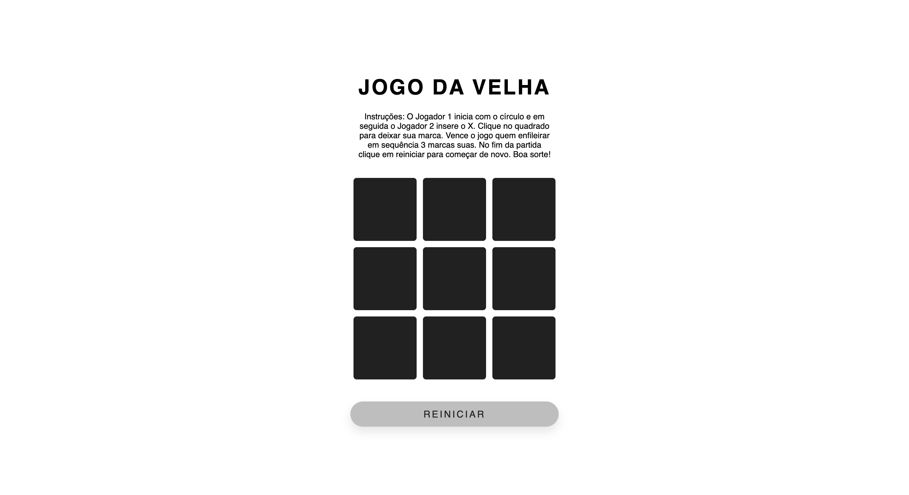

# Jogo da Velha

Um Jogo da Velha desenvolvido com HTML, CSS e JavaScript. Um ótimo desafio para treinar conhecimentos JS que vão do básico ao avançado.
 
 

## Deploy

Acesse aqui: [Netlify](jogo-da-velha-glayson-b-santos.netlify.app)
 
 

## Printscreen

